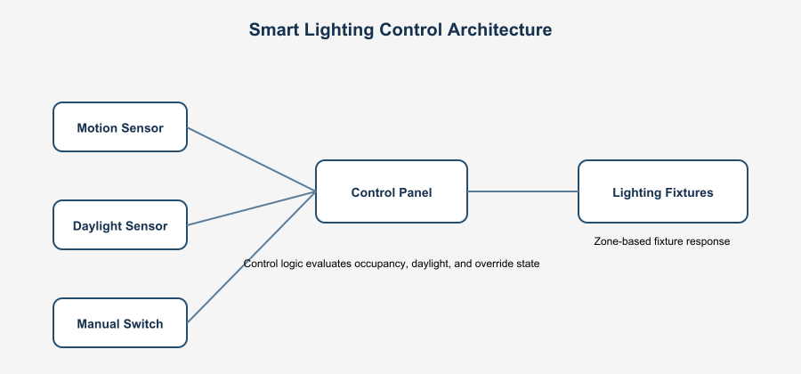

# Smart-lighting-control-system
Full-stack smart lighting control system for commercial spaces using Fusion 360, Packet Tracer, Python, FastAPI, and Streamlit with control logic, IoT telemetry, and monitoring dashboard.

# Smart Lighting Control System Design (Commercial Office)

## Overview

This project presents a full-stack smart lighting control system designed for a commercial office environment. It combines physical layout design, control logic, network simulation, and IoT-based monitoring into a single integrated system.

The goal is to demonstrate how modern lighting systems operate across multiple layers, including sensing, control, communication, and visualization.

---

## Project Preview

### System Layout

### Architecture Diagram

---

## Key Features

* Multi-zone lighting control (Reception, Conference, Open Workspace, Hallway, Offices)
* Occupancy-based automation using motion sensors
* Daylight-responsive dimming for energy efficiency
* Manual override via wall switches
* Centralized control panel (edge logic)
* IoT-enabled telemetry and monitoring
* Real-time dashboard visualization

---

## System Architecture

### Layers Included:

1. **Physical Layer**

   * Fusion 360 layout design
   * Smart light fixtures, sensors, and control enclosure

2. **Control Layer**

   * Edge controller processes inputs and sends commands
   * Sequence of operations for lighting behavior

3. **Network Layer**

   * Simulated using Packet Tracer
   * Controller → Gateway → Router → Backend

4. **Data Layer**

   * Sensor simulation using Python
   * API processing using FastAPI
   * Time-series data structure

5. **Application Layer**

   * Streamlit dashboard
   * Real-time monitoring and system status

---

## System Flow

Sensors → Controller → Relay → Lighting
Controller → Gateway → Router → API → Database → Dashboard

---

## Tools & Technologies

* Fusion 360 (CAD layout & system modeling)
* Packet Tracer (network simulation)
* Python (control logic & sensor simulation)
* FastAPI (backend API)
* Streamlit (dashboard visualization)
* GitHub (version control)

---

## Repository Structure

* `/cad` → Fusion 360 designs and layout screenshots
* `/diagrams` → Architecture, control logic, and network diagrams
* `/simulation` → Python logic and test cases
* `/iot` → Sensor simulation, API, and dashboard
* `/docs` → Full system documentation (PDF, BOM, SOO)

---

## Real-World Relevance

This project reflects how commercial lighting control systems are designed, documented, and integrated with modern IoT infrastructure. It demonstrates system thinking across physical, network, and software layers.

---

## Author

**Eric Amoh Adjei**

### Control Logic

